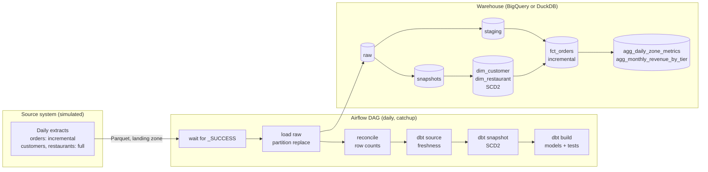
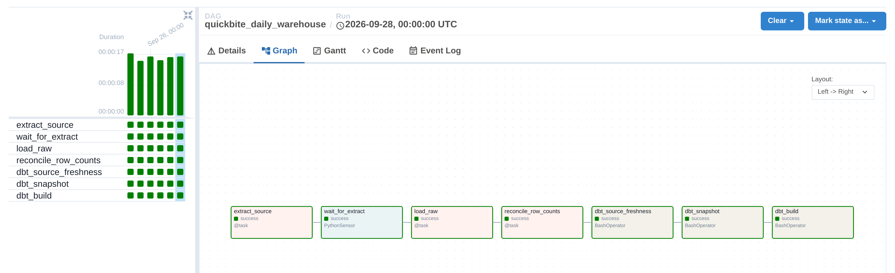
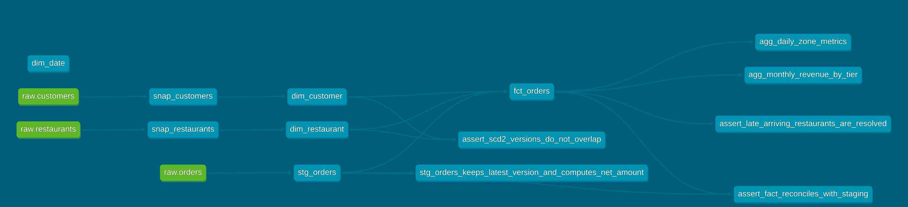

# QuickBite: Analytics Warehouse (Airflow + dbt + BigQuery)

The batch half of the QuickBite data platform. Every night, a food-delivery
app's source system exports orders, customers and restaurants. This project turns
those exports into a tested, dimensional warehouse:

- **Airflow** orchestrates the daily pipeline.
- **dbt** models the data into a star schema with **SCD Type 2** history.
- **BigQuery** (or DuckDB locally) stores it.
- **Terraform** creates the cloud resources.
- **GitHub Actions** runs the whole pipeline end to end on every push.

The real-time half is in
[quickbite-realtime-lakehouse](https://github.com/SubashDevarajan/quickbite-realtime-lakehouse).


---

## Architecture



**Star schema:** `fct_orders` (one row per order) joins to `dim_customer`, `dim_restaurant` (SCD Type 2) and `dim_date`.

**Airflow back-filling a week, one day at a time** (every task green, ~16 s per day on DuckDB):



**dbt lineage** from raw tables through snapshots and dimensions to the fact, marts and custom tests:



## What this project demonstrates

| Concept | Where | Why it matters |
|---|---|---|
| **SCD Type 2** | `transform/snapshots/`, `dim_customer`, `dim_restaurant` | Customers change loyalty tier and restaurants change commission rate; history is kept, not overwritten |
| **Point-in-time joins** | `fct_orders` | Each order uses the commission rate and tier valid *when it was placed*, so past revenue never changes when a dimension does |
| **Incremental models + look-back** | `fct_orders` | Only recent orders are processed each day, and the 3-day look-back picks up late refunds |
| **Late-arriving dimensions** | `fct_orders`, unknown member `-1` | Orders for a restaurant not yet in the catalogue are kept (never dropped) and re-pointed automatically once it arrives; a test enforces this |
| **Idempotent loads** | `quickbite/loader.py` | Each day replaces exactly its own partition, so retries and back-fills are safe |
| **Back-fill with ordering guarantees** | DAG: `catchup`, `max_active_runs=1`, `depends_on_past` | History is rebuilt day by day, in order, from any start date |
| **Data quality gates** | dbt tests, reconciliation task, source freshness | Bad data fails the run *before* anyone sees wrong numbers |
| **dbt unit tests** | `stg_orders` unit test | Transformation logic tested on fixed input rows, like a function |
| **Sensors & markers** | `wait_for_extract` + `_SUCCESS` | A half-written file is never loaded |
| **Pools** | `warehouse` pool (1 slot) | Serialises writers where the engine allows only one (DuckDB) |
| **Cost optimisation** | `fct_orders` partitioned by date and clustered (BigQuery), `make cost-report` | Queries scan only the partitions they need; `make cost-report` measures the saving |
| **Infrastructure as code** | `infra/terraform/` | Bucket, datasets and a least-privilege service account, reviewed like code |
| **CI/CD** | `.github/workflows/ci.yml` | Lint, unit tests, 5-day end-to-end run with every dbt test, idempotency re-run, DAG integrity, `terraform validate` |

---

## Run it on your Mac (free, no cloud account)

### Prerequisites
- **Docker Desktop** with at least **6 GB of memory** (Settings → Resources)
- `make` and `git` (install with `xcode-select --install`)

### Start

```bash
git clone https://github.com/SubashDevarajan/quickbite-analytics-warehouse.git
cd quickbite-analytics-warehouse
make up
```

The first build takes 5–10 minutes. `make up` creates a `.env` with
`QB_START_DATE` set to 7 days ago, so Airflow back-fills a week of history.

Open **http://localhost:8080** and log in as `airflow` / `airflow`.

| What you'll see | When |
|---|---|
| `quickbite_daily_warehouse` DAG, unpaused | ~1 minute after start |
| Runs going green one day at a time in **Grid** view | ~1–2 minutes per day |
| All 7 days done | ~10–15 minutes |

### Explore

```bash
make runs                  # every DAG run and its state
make sql                   # interactive SQL on the warehouse
make sql Q="select * from marts.agg_daily_zone_metrics order by order_date desc, gmv desc limit 10"
make docs                  # dbt docs + lineage graph at http://localhost:8081 (Ctrl+C to stop)
```

Queries worth running:

```sql
-- SCD2: a customer's full history
select customer_id, loyalty_tier, zone, valid_from, valid_to, is_current
from marts.dim_customer where customer_id in (
  select customer_id from marts.dim_customer group by 1 having count(*) > 1 limit 1);

-- Revenue by the tier customers had WHEN they ordered
select * from marts.agg_monthly_revenue_by_tier order by month, loyalty_tier;

-- Late-arriving restaurants: orders still pointing at the unknown member
select order_date, count(*) from marts.fct_orders where restaurant_key = '-1' group by 1;
```

### Drills

| Drill | Command | What it proves |
|---|---|---|
| Re-run a finished day | `make rerun DAY=<a date already done>` then compare `make sql` counts | Idempotency: same result, no duplicates |
| Break a task | In the Airflow UI, mark `dbt_build` failed for a day, then clear it | Retries and recovery from the failed step |
| Back-fill further | Set an earlier `QB_START_DATE` in `.env`, then `make down && make up` | Catch-up builds history in order |
| Lineage | `make docs` | The full model graph from raw to marts |

### Stop

```bash
make down    # stop, keep data
make clean   # stop and delete everything
```

## Run it on BigQuery (optional)

1. Create the infrastructure: see [infra/terraform/README.md](infra/terraform/README.md) (about 5 minutes with a GCP free-trial account).
2. Set `WAREHOUSE=bigquery`, `GCP_PROJECT`, `GCS_BUCKET` and the key path in `.env`.
3. `make clean && make up`
4. After a few days have loaded, run `make cost-report` for the partitioning savings.

The same dbt models run on both engines. The few SQL differences are handled
by small macros in `transform/macros/cross_db.sql`.

## Results

| Metric | Value |
|---|---|
| Days back-filled | 7 (configurable) |
| Orders per day | ~1,500 (~2,000 on weekends) |
| dbt models / tests | 7 models, 2 snapshots, 31 data tests, 1 unit test |
| Idempotent re-run | row count and GMV identical (checked in CI on every push) |

---

## Project layout

```
├── airflow/dags/          # the daily DAG
├── quickbite/             # Python: source simulator, landing zone, loader, local runner, SQL shell
├── transform/             # dbt project
│   ├── models/staging/    # stg_orders (+ unit test), sources with freshness
│   ├── models/marts/      # dims (SCD2), fct_orders (incremental), aggregates
│   ├── snapshots/         # SCD2 snapshots
│   ├── macros/            # DuckDB/BigQuery differences
│   └── tests/             # custom data tests
├── infra/terraform/       # GCS bucket, BigQuery datasets, service account + IAM
├── tests/                 # pytest: generator, loader idempotency, DAG integrity
├── docs/design-decisions.md
├── docker-compose.yml     # Postgres + Airflow (LocalExecutor)
└── Makefile
```

## Develop without Docker

```bash
python3.11 -m venv .venv && source .venv/bin/activate
make install-dev
make test          # unit tests
make local         # 7 days end to end on DuckDB, no Airflow
```

See [docs/design-decisions.md](docs/design-decisions.md) for the trade-offs behind each choice.
